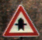
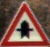
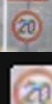

# traffic-sign-detection

This project is an implementation of a Kaggle competition. 98.4 % accuracy on the classification task.

# Goal

Classify correctly traffic signs in Torch.

# Data augmentation visualization :

Given an image with a traffic sign, center the traffic sign :

Then apply various image transformations described after.

# Implementation

* data: folder containing the train/test data tensors.
* images: images for readme.
* models: Different convnet models implemented.
* notebooks: Visualizing the data, preprocessing transformations and data augmentation.
* main.lua: load data, model, and train/evaluate the model.
* preprocess.lua: normalize the train/test set. ZCA (or de-correlation) not implemented yet.
* utils.lua: Data transformations utils, examples are :
  * Center the traffic sign in an image: Given an image and the coordinate of the traffic sign in it, return the image centered on the traffic sign.
  * change image contrast
  * rotation.
  * translation.
  * saturation.
  * brightness.
